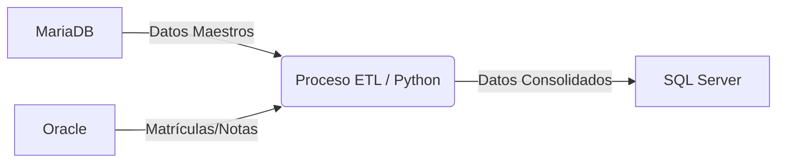

# 🗄️ Plataforma de Base de Datos Heterogénea


Este repositorio contiene la implementación de una **plataforma de bases de datos heterogénea** que integra múltiples motores mediante un proceso ETL automatizado.

El objetivo principal es demostrar una arquitectura centralizada de análisis de datos, consolidando información transaccional dispersa en un almacén analítico unificado.

---

## 🏗️ Arquitectura

El flujo de información sigue un esquema de extracción, transformación y carga (ETL) centralizado en un servidor Linux.

### Componentes del Sistema

| Componente | Rol | Descripción |
| :--- | :--- | :--- |
| **MariaDB** | Datos Maestros | Repositorio de estudiantes, docentes y asignaturas. |
| **Oracle** | Transaccional | Base de datos académica (matrículas y calificaciones). |
| **SQL Server** | Analítico | Data Warehouse implementado bajo un modelo dimensional. |
| **Ubuntu Server** | Orquestador | Servidor encargado de ejecutar los scripts Python y cron jobs. |

### Flujo de Datos



### Requisitos Previos

Para desplegar este proyecto, asegúrate de contar con lo siguiente:

* 🐧 **Sistema Operativo:** Ubuntu Server 22.04
* 🐍 **Lenguaje:** Python 3.x
* 🐳 **Contenedores:** Docker y Docker Compose (opcional)
* 🔑 **Acceso a instancias:** MariaDB, Oracle y SQL Server activos.


## ⚙️ Configuración e Instalación

### 1. Clonar el repositorio 🔗📥

Descarga el código fuente en tu servidor:

```bash
git clone https://github.com/Sebasflm/db-plataforma-heterogenea.git
cd db-plataforma-heterogenea
```

### 2. Variables de Entorno 🧪⚙️

Crea un archivo .env en la raíz del proyecto para gestionar las credenciales de forma segura.

```bash
nano .env
```

Copia y pega la siguiente estructura completando con tus datos reales:

```ini
# --- MariaDB (Maestros) ---
MARIADB_HOST=192.168.x.x
MARIADB_PORT=3306
MARIADB_DB=nombre_db
MARIADB_USER=usuario
MARIADB_PASSWORD=contraseña

# --- Oracle (Transaccional) ---
ORACLE_HOST=192.168.x.x
ORACLE_PORT=1521
ORACLE_SERVICE=xe
ORACLE_USER=usuario
ORACLE_PASSWORD=contraseña

# --- SQL Server (Analítico) ---
SQLSERVER_HOST=192.168.x.x
SQLSERVER_PORT=1433
SQLSERVER_DB=nombre_dw
SQLSERVER_USER=sa
SQLSERVER_PASSWORD=contraseña
```
**Nota:** Las credenciales se cargan dinámicamente mediante variables de entorno, evitando exponer contraseñas en el código fuente.

### 3. Ejecución de Scripts ▶️📜
El sistema está diseñado para ejecutarse en un orden específico para garantizar la integridad de los datos.

#### 1️⃣ Generación de Datos (Faker)
Si necesitas poblar las bases de datos con información de prueba:

**01_faker_mariadb.py:** Genera los datos maestros (Estudiantes, Docentes).

**02_faker_oracle.py:** Genera datos académicos (Notas, Matrículas).

#### 2️⃣ Proceso ETL

**03_etl_sqlserver.py:** Extrae la data de MariaDB y Oracle, la transforma y la carga en el modelo dimensional de SQL Server.

### 4. Automatización (Crontab) ⏰🤖

Para que el proceso ETL se ejecute automáticamente en tu servidor Ubuntu:

#### 1️⃣ Abre el editor de tareas programadas:

```bash
crontab -e
```
#### 2️⃣ Agrega la siguiente línea al final del archivo (ajusta la ruta según tu usuario):

```bash
* * * * * /usr/bin/python3 /home/usuario/db-plataforma-heterogenea/scripts/03_etl_sqlserver.py >> /home/usuario/db-plataforma-heterogenea/etl.log 2>&1
```

### 5. Monitoreo de Logs 📊📄

Puedes revisar si el proceso está funcionando correctamente viendo el archivo de log en tiempo real:

```bash
tail -f etl.log
```
Hecho con ❤️ y Python.

